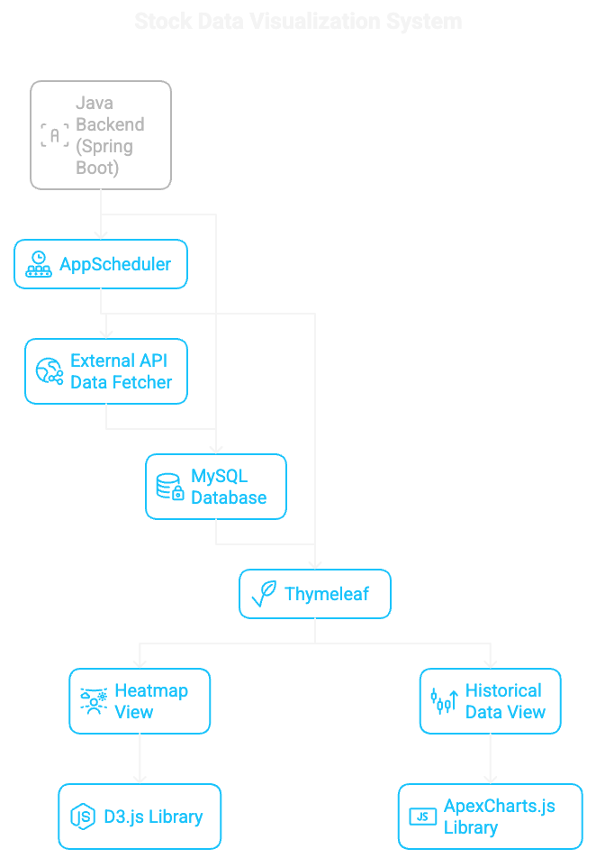
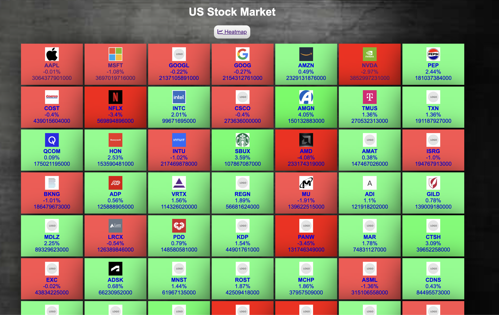
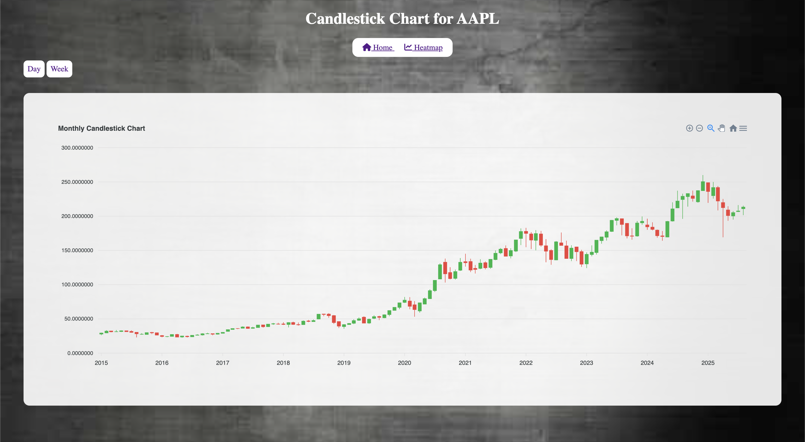

# Stock project

A dual-feature stock analysis dashboard built with Java Spring Boot and Thymeleaf.

- 🔥 **NDX100 Demo-Heatmap View**
  - Visualizes top 100 Nasdaq stocks in a dynamic heatmap
  - Built using D3.js for interactive rendering
  - Styled with simple CSS
  - Server-rendered via Thymeleaf

- 📈 **Historical Demo-Data View**
  - Displays historical stock data with candlestick charts
  - Built using ApexCharts.js
  - Allows users to explore individual stock performance over time

## Architecture Diagram

## UI Preview

  

  

